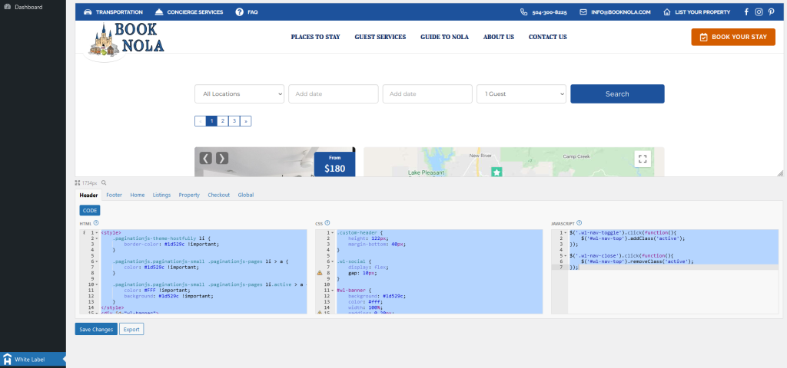

<!-- PROJECT LOGO -->
 

  

  <h3 align="center">Hostfully White Label</h3>

  

    WordPress Plugin
     
    <a href="https://github.com/MickeyUK/hostfully-white-label/releases">Latest Release</a>
    ·
    <a href="https://github.com/MickeyUK/hostfully-white-label/issues">Report Bug</a>
    ·
    <a href="https://github.com/MickeyUK/hostfully-white-label/issues">Request Feature</a>
  

<!-- TABLE OF CONTENTS -->

  
<h2 style="display: inline-block">Table of Contents</h2>

  <ol>
    <li>
      <a href="#about-the-project">Overview</a>
    </li>
    <li><a href="#about-the-project">About the Project</a></li>
    <li><a href="#features">Features</a></li>
    <li><a href="#roadmap">Roadmap</a></li>
    <li><a href="#license">License</a></li>
    <li><a href="#contact">Contact</a></li>
    <li><a href="#acknowledgements">Acknowledgements</a></li>
  </ol>

## About the Project

A WordPress plugin for creating white label code for [Hostfully](https://hostfully.com). This plugin will take care of various issues and override styling that Hostfully tries to force.

## Features

**Default Theme Improvements**
This plugin automatically inserts a few CSS tweaks to the default Hostfully theme, fixing any potential issues with custom white label code, making things look a bit neater and making it more mobile responsive.

---

**Inject Header on Homepage**

By default, Hostfully does not show your custom header on your agency's homepage, only the footer. This plugin adds an extra bit of javascript that will automatically inject your custom header.

## How to Use

When you install the plugin, it will add **White Label** option to the dashboard. Here you'll find an editor for writing your custom HTML, CSS and JavaScript white label code. The previews give you an idea of how the white label code will appear on the Hostfully website.

Each customizable section of your agency pages are split in to tabs to make things easier to manage.

Clicking **Export** will display the merged white label code. Copy and paste each code snippet to the corresponding boxes on the White Labelling section of your Hostfully agency dashboard.

## Roadmap

See the [open issues](https://github.com/MickeyUK/hostfully-white-label/issues) for a list of proposed features (and known issues).

## License

See `LICENSE.txt` for more information.

## Contact

Project Link: [https://github.com/MickeyUK/hostfully-white-label/](https://github.com/MickeyUK/hostfully-white-label/)

<!-- ACKNOWLEDGEMENTS -->
## Acknowledgements

* [MickeyUK] - [GitHub](https://github.com/MickeyUK)